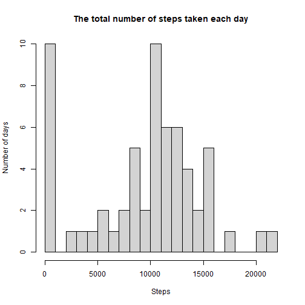
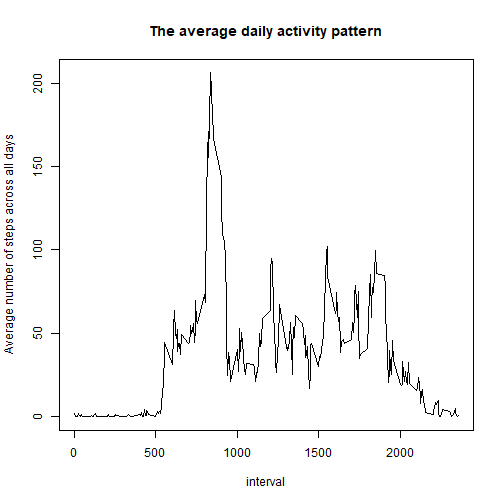
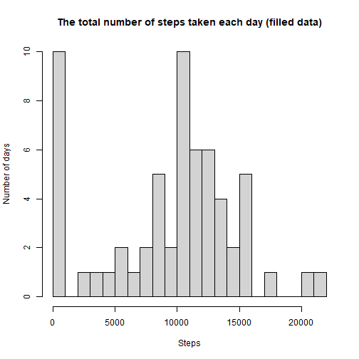
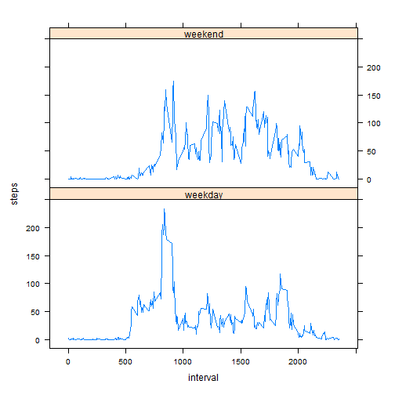

## Loading and preprocessing the data
  
  First, let's unzip the data file and read the data into R.
    

```r
outdir <- getwd()
unzip("activity.zip", exdir = outdir)
mydata <- read.csv("activity.csv", header = TRUE)
```
    
  The structure, first 6 lines, and class of the data are shown as the follows:
    

```r
str(mydata)
```

```
## 'data.frame':	17568 obs. of  3 variables:
##  $ steps   : int  NA NA NA NA NA NA NA NA NA NA ...
##  $ date    : chr  "2012-10-01" "2012-10-01" "2012-10-01" "2012-10-01" ...
##  $ interval: int  0 5 10 15 20 25 30 35 40 45 ...
```

```r
head(mydata)
```

```
##   steps       date interval
## 1    NA 2012-10-01        0
## 2    NA 2012-10-01        5
## 3    NA 2012-10-01       10
## 4    NA 2012-10-01       15
## 5    NA 2012-10-01       20
## 6    NA 2012-10-01       25
```

```r
class(mydata)
```

```
## [1] "data.frame"
```

## What is mean total number of steps taken per day?
  
  We grouped the data by date and summarized the total number of steps taken each day.


```r
library(dplyr)
library(lubridate)
q1data <- mydata %>%
    mutate(date = ymd(date)) %>%
    group_by(date) %>%
    summarise(steps = sum(steps, na.rm = TRUE))
head(q1data)
```

```
## # A tibble: 6 × 2
##   date       steps
##   <date>     <int>
## 1 2012-10-01     0
## 2 2012-10-02   126
## 3 2012-10-03 11352
## 4 2012-10-04 12116
## 5 2012-10-05 13294
## 6 2012-10-06 15420
```

  The histogram of the total number of steps taken each day is shown as below:


```r
hist(q1data$steps, breaks = 20, 
     xlab = "Steps", ylab = "Number of days",
     main = "The total number of steps taken each day")
```



  The mean number of steps taken per day is:


```r
mean(q1data$steps, na.rm = TRUE)
```

```
## [1] 9354.23
```

  The median number of steps taken per day is:


```r
median(q1data$steps, na.rm = TRUE)
```

```
## [1] 10395
```

## What is the average daily activity pattern?

  We grouped the data by intervals and summarized the total number of steps taken during each interval.
  

```r
q2data <- mydata %>%
    group_by(interval) %>%
    summarise(steps = mean(steps, na.rm = TRUE))
head(q2data)
```

```
## # A tibble: 6 × 2
##   interval  steps
##      <int>  <dbl>
## 1        0 1.72  
## 2        5 0.340 
## 3       10 0.132 
## 4       15 0.151 
## 5       20 0.0755
## 6       25 2.09
```

  The time series plot of the average number of steps taken during each intervals is shown as below:


```r
within(q2data, plot(interval, steps, type = "l",
                    ylab = "Average number of steps across all days",
                    main = "The average daily activity pattern"))
```



```
## # A tibble: 288 × 2
##    interval  steps
##       <int>  <dbl>
##  1        0 1.72  
##  2        5 0.340 
##  3       10 0.132 
##  4       15 0.151 
##  5       20 0.0755
##  6       25 2.09  
##  7       30 0.528 
##  8       35 0.868 
##  9       40 0     
## 10       45 1.47  
## # … with 278 more rows
```

  The 5-minute interval that, on average, contains the maximum number of steps is:


```r
q2data$interval[which.max(q2data$steps)]
```

```
## [1] 835
```

## Imputing missing values
  
  The total number of missing values in the dataset is:


```r
totalMV <- sum(is.na(mydata$steps))
totalMV
```

```
## [1] 2304
```

  To impute missing values in the dataset, I write a functon that takes the dataset with missing values and the dataset which contains the total number of steps taken per day as parameters. Specifically, I use the mean number of steps for that day to fill in the missing values on that day.


```r
impdata <- mydata %>%
    mutate(date = ymd(date)) %>%
    group_by(date) %>%
    summarise(steps = mean(steps, na.rm = TRUE))

imputeMV <- function(ori_data, imp_data) {
    MVid <- which(is.na(ori_data$steps)==1)
    ori_data <- mutate(ori_data, date = ymd(date))
    for (i in 1:length(MVid)) {
        fillid <- which(imp_data$date==ori_data$date[MVid[i]])
        ori_data$steps[MVid[i]] <- imp_data$steps[fillid]
    }
    return(ori_data)
}

mydata2 <- imputeMV(mydata, impdata)
```

  The histogram of the total number of steps taken each day after missing values are imputed is as below


```r
q3data <- mydata2 %>%
    group_by(date) %>%
    summarise(steps = sum(steps, na.rm = TRUE))
hist(q3data$steps, breaks = 20, 
     xlab = "Steps", ylab = "Number of days",
     main = "The total number of steps taken each day (filled data)")
```



  The mean and median number of steps taken per day are:
  

```r
mean(q3data$steps, na.rm = TRUE)
```

```
## [1] 9354.23
```

```r
median(q3data$steps, na.rm = TRUE)
```

```
## [1] 10395
```
  
  As we can see, the mean and median number of steps taken per day in the dataset after imputing missing values are the same as they are in the original dataset.
  
## Are there differences in activity patterns between weekdays and weekends?

  Create a new factor variable in the dataset with two levels – “weekday” and “weekend” indicating whether a given date is a weekday or weekend day.
  

```r
Sys.setlocale("LC_TIME", "English")
```

```
## [1] "English_United States.1252"
```

```r
mydata2$weekdays <- weekdays(mydata2$date)
mydata2$weekdays[which(mydata2$weekdays%in%c("Monday","Tuesday","Wednesday","Thursday","Friday" ))] <- "weekday"
mydata2$weekdays[which(mydata2$weekdays%in%c("Saturday","Sunday"))] <- "weekend"
mydata2$weekdays <- as.factor(mydata2$weekdays)
head(mydata2)
```

```
##   steps       date interval weekdays
## 1   NaN 2012-10-01        0  weekday
## 2   NaN 2012-10-01        5  weekday
## 3   NaN 2012-10-01       10  weekday
## 4   NaN 2012-10-01       15  weekday
## 5   NaN 2012-10-01       20  weekday
## 6   NaN 2012-10-01       25  weekday
```

  The time series plot of the 5-minute interval and the average number of steps taken, averaged across all weekday days or weekend days is shown as below:


```r
q4data <- mydata2 %>%
    group_by(interval,weekdays) %>%
    summarise(steps = mean(steps, na.rm = TRUE))
```

```
## `summarise()` has grouped output by 'interval'. You can override
## using the `.groups` argument.
```

```r
library(lattice)
xyplot(steps~interval|weekdays, q4data, layout = c(1,2), type = "l")
```


